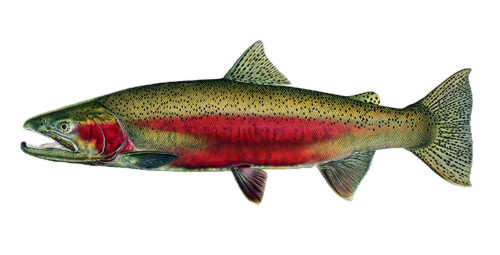

```{r setup, include=FALSE}
knitr::opts_chunk$set(echo = TRUE, message = FALSE, warning = FALSE)


# For general stuff:
library(tidyverse)
library(janitor)
library(lubridate)
library(here)
library(paletteer)

# For ts stuff: 
library(tsibble)
library(fable)
library(fabletools)
library(feasts)
library(forecast)

fish <- read_csv("cbr_fish_passage_bonneville_allyrs_steelhead.csv")

View(fish)
names(fish)
unique(fish$value)


# by day
  
fishdate <-  fish %>% 
  separate(`mm-dd`, into = c("day", "month")) %>% 
  mutate(date = paste(year, month, day, sep = "-"),
         month_sep = paste(year, month, sep = "-"),
         month_sep1= yearmonth(month_sep)) %>% 
  drop_na(value)

 # by month
        

fishdate2 <- fishdate %>% 
  group_by(month_sep1) %>% 
  summarise(
    sumvalue= sum(value)) 

#  by year

fishdate3 <- fishdate %>% 
  group_by(year) %>% 
  summarise(
    sumvalue =sum(value)
  )

fishdate3

# plots 

# by day

fish_gg <- ggplot(data = fishdate, aes(x = month_sep1, y = value)) +
  geom_line() +
  theme_minimal() +
  scale_y_continuous(limits = c(0, 350))

fish_gg

# by month

fish_gg2 <- ggplot(data = fishdate2, aes(x = month_sep1, y = sumvalue)) +
  geom_line() +
  theme_minimal() 

fish_gg2

# by year

fish_gg3 <- ggplot(data = fishdate3, aes(x = year, y = sumvalue)) +
  geom_line() +
  theme_minimal() 

fish_gg3

# Parse the data
fish_parsed <- fishdate2 %>% 
  mutate(month = month(month_sep1, label = TRUE)) %>% 
  mutate(year = year(month_sep1))

### Coerce to a tsibble:

fish_ts <- as_tsibble(fish_parsed, index = month_sep1)


fishplot2 <- ggplot(data = fish_parsed, aes(x = month, y = sumvalue, group = year)) +
  geom_line(aes(color = year)) 

fishplot2


```

<p>&nbsp;</p>

**Project 3: Time series data wrangling, exploration and visualization**

In this project I will wrangle, explore, and visualize time series data for steelhead salmon passage across the Bonneville Dam (Oregon) from 1940 - 2019. I will present a  time series plot with daily data on passage counts, a seasonplot to explore if/how monthly passage has shifted over time, and a visualization of annual steelhead passage counts. 


<p>&nbsp;</p>

```{r out.width = "70%", fig.align = "center", echo = FALSE}




```
<center> 

Steelhead *(Oncorhynchus mykiss)*. *Photo: United States Department of Agriculture, Forest Service* 

</center>

<p>&nbsp;</p>
<p>&nbsp;</p>

This is the code I used to produce Figure 1:
```{r}
fish <- read_csv("cbr_fish_passage_bonneville_allyrs_steelhead.csv")

fishdate <-  fish %>% 
  separate(`mm-dd`, into = c("day", "month")) %>% 
  mutate(date = paste(year, month, day, sep = "-"),
         month_sep = paste(year, month, sep = "-"),
         month_sep1= yearmonth(month_sep)) %>% 
  drop_na(value)

fish_gg <- ggplot(data = fishdate, aes(x = month_sep1, y = value)) +
  geom_line() +
  theme_minimal() +
  scale_y_continuous(limits = c(0, 350)) +
    labs (x = "Time (days)", y = "Count", title = "Time series of passage counts for Steelhead in Bonneville Dam (1939-2019)")

fish_gg


```

**Figure 1**: Time series of passage counts for Steelhead in Bonneville Dam (1939-2019) per day. *Source: Columbia River DART, Columbia Basin Research, University of Washington. (2019). Adult Passage Graphics & Text.*

<p>&nbsp;</p>

Since it seems really difficult to identify any patterns with the data presented by day, I tried a new time series plot, but this time by month.

<p>&nbsp;</p>

This is the code I used to produce Figure 2:

```{r}
fishdate2 <- fishdate %>% 
  group_by(month_sep1) %>% 
  summarise(
    sumvalue= sum(value)) 

fish_gg2 <- ggplot(data = fishdate2, aes(x = month_sep1, y = sumvalue)) +
  geom_line() +
  theme_minimal() +
   labs (x = "Time (months)", y = "Count", title = "Time series of passage counts for Steelhead in Bonneville Dam (1939-2019)") + scale_y_continuous(labels = scales::comma)

fish_gg2
```


**Figure 2**: Time series of passage counts for Steelhead in Bonneville Dam (1939-2019) per month *Source: Columbia River DART, Columbia Basin Research, University of Washington. (2019). Adult Passage Graphics & Text.*

<p>&nbsp;</p>

As observed in Figure 2, there is a very clear annual seasonality, but no clear cyclical trend. Even though there is a massive increase of salmon counts around years 2001 and 2010, it's not clear that the trend is increasing. In fact, starting in year 2015, there is an important decrease in counts.

<p>&nbsp;</p>

This is the code I used to produce Figure 3:
```{r}
# Parse the data
fish_parsed <- fishdate2 %>% 
  mutate(month = month(month_sep1, label = TRUE)) %>% 
  mutate(year = year(month_sep1))

### Coerce to a tsibble:

fish_ts <- as_tsibble(fish_parsed, index = month_sep1)


fishplot2 <- ggplot(data = fish_parsed, aes(x = month, y = sumvalue, group = year)) +
  geom_line(aes(color = year)) + 
  theme_minimal() +
   labs (x = "Month", y = "Count", title = "Seasonplot of monthly passage of Steelhead in Bonneville Dam (1939-2019)") + scale_y_continuous(labels = scales::comma)

fishplot2

```

**Figure 3**: "Seasonplot of monthly passage of Steelhead in Bonneville Dam (1939-2019). *Source: Columbia River DART, Columbia Basin Research, University of Washington. (2019). Adult Passage Graphics & Text.*

<p>&nbsp;</p>

Figure 3 clearly shows that steelhead count peaks in August every year, and that those peaks have been getting larger in the 2000's.

<p>&nbsp;</p>

This is the code I used to produce Figure 4:
```{r}

fishdate3 <- fishdate %>% 
  group_by(year) %>% 
  summarise(
    sumvalue =sum(value)
  )

fish_gg3 <- ggplot(data = fishdate3, aes(x = year, y = sumvalue)) +
  geom_line() +
  theme_minimal() +
  labs (x = "Year", y = "Count", title = "Annual Steelhead passage counts in Bonneville Dam (1939-2019)") + scale_y_continuous(labels = scales::comma)

fish_gg3
```

**Figure 4**: "Annual Steelhead passage counts in Bonneville Dam (1939-2019). *Source: Columbia River DART, Columbia Basin Research, University of Washington. (2019). Adult Passage Graphics & Text.*

<p>&nbsp;</p>

Figure 4 shows even more clearly the patterns of annual seasonality and relatively sustained increased in counts towards the year 2000-2010, and a decline after year 2015.
