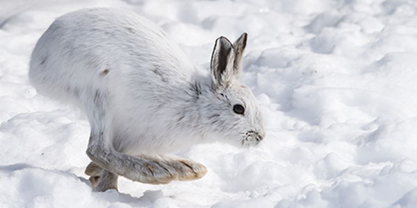

```{r setup, include=FALSE}

knitr::opts_chunk$set(echo = TRUE)

# First we load the packages:
library(tidyverse)
library(png) 
library(jpeg)
library(knitr)
library(kableExtra)

library(janitor)
library(naniar)
library(VIM)
library(skimr)
library(ggfortify)

# Read data

snowshoe <- read_csv("showshoe_lter.csv")

```

<p>&nbsp;</p>

**Project 1: Data wrangling & visualization (snowshoe hares)**

This project will compare the relations between age and weight, and sex and weight for snowshoe population. The data was taken from Kielland et al (2017), and corresponds to snowshoe hares observed in Bonanza Creek Experimental Forest, Alaska, US. 

<p>&nbsp;</p>

```{r out.width = "70%", fig.align = "center", echo = FALSE}




```
<center> 

Snowshoe hare *(Lepus americanus)*. *Photo: The National Wildlife Federation* 

</center>

<p>&nbsp;</p>

This is the code I used to produce the graph that comes after:

```{r}

snowshoetidy <- snowshoe %>%
  rename(Age=age) %>% 
  select(l_ear, r_ear, sex, Age, weight, hindft) %>%  
  filter(sex %in% c("f","m", "M", "F")) %>% 
  mutate(                     
      sex = case_when(
  sex == "f" ~ "F",
  sex == "m" ~ "M")) %>% 
  filter(sex != "NA")  %>% 
  filter(Age %in% c("a","j", "A", "J")) %>% 
  mutate(                       
      Age = case_when(
  Age == "a" ~ "A",
  Age == "j" ~ "J")) %>% 
  filter(Age != "NA")  

agesexweighttidybox <- ggplot(snowshoetidy, aes(x=sex, y=weight))+
  geom_boxplot(aes(color=Age)) +
  labs (x = "Sex", y = "Weight (grams)", title = "Snowshoe hare weight per sex and age") +
  theme_classic() 

```


<p>&nbsp;</p>

```{r, echo=FALSE, message=FALSE, warning=FALSE}

# The dataframe looks very messy...lots of NAs and poorly codified values (such as lower and upper case m, f, and exclamation signs). Let's clean it up!

snowshoetidy <- snowshoe %>% 
  rename(Age=age) %>% 
  select(l_ear, r_ear, sex, Age, weight, hindft) %>%  # First, select only the variables we're interested in:
  filter(sex %in% c("f","m", "M", "F")) %>% # Then, keep only observations that are certain to be either male or female
  mutate(                       # replace lower case observations with upper case
      sex = case_when(
  sex == "f" ~ "F",
  sex == "m" ~ "M")) %>% 
  filter(sex != "NA")  %>% 
  filter(Age %in% c("a","j", "A", "J")) %>% # Then, keep only observations that are certain to be either male or female
  mutate(                       # replace lower case observations with upper case
      Age = case_when(
  Age == "a" ~ "A",
  Age == "j" ~ "J")) %>% 
  filter(Age != "NA")  # get rid of NA values

# Let's look at relation of weight with age and sex in a boxplot

agesexweighttidybox <- ggplot(snowshoetidy, aes(x=sex, y=weight))+
  geom_boxplot(aes(color=Age)) +
  labs (x = "Sex", y = "Weight (grams)", title = "Snowshoe hare weight per sex and age") +
  theme_classic()

agesexweighttidybox


# Now is looking better. But we don't see a big difference between male and female weights. Only a slighltly higher distribution of weight for females...let's explore other interesting relations..


```
\newline
```{r}
 
```

**Figure 1**: Differences in weight for snowshoe hares based on age and sex. *Source: Kielland K., F. S. Chapin, R. W. Ruess. 2017. Snowshoe hare physical data in Bonanza Creek Experimental Forest: 1999-Present. Environmental Data Initiative.*

<p>&nbsp;</p>

*Figure 1* shows that adult individuals are in average much heavier than juveniles. This is valid for both sexes, between which no great differences are observed. 

<p>&nbsp;</p>


This is the code I used to produce the table that comes after:

```{r}
summary_snow<- snowshoetidy %>% 
  rename(Sex=sex) %>% 
  group_by(Sex) %>% 
  summarise(
    Median = round(median(weight, na.rm = TRUE), digits = 2),
    Maximum = round(max(weight, na.rm = TRUE), digits = 2),
    Mean = round(mean(weight, na.rm = TRUE), digits = 2),
    `Standard Deviation` = round(sd(weight, na.rm = TRUE), digits = 2),
    `Sample Size`= length(weight)) 
 
table_snow <- kable(summary_snow,
                   booktabs = T) %>%
  kable_styling(bootstrap_option = c("striped", "hover", "condensed", "responsive", "hold_position"), full_width = FALSE, position = "center")

```

<p>&nbsp;</p>

```{r, echo=FALSE, message=FALSE, warning=FALSE}

summary_snow<- snowshoetidy %>% 
  rename(Sex=sex) %>% 
  group_by(Sex) %>% 
  summarise(
    Median = round(median(weight, na.rm = TRUE), digits = 2),
    Maximum = round(max(weight, na.rm = TRUE), digits = 2),
    Mean = round(mean(weight, na.rm = TRUE), digits = 2),
    `Standard Deviation` = round(sd(weight, na.rm = TRUE), digits = 2),
    `Sample Size`= length(weight)) 
 
table_snow <- kable(summary_snow,
                   booktabs = T) %>%
  kable_styling(bootstrap_option = c("striped", "hover", "condensed", "responsive", "hold_position"), full_width = FALSE, position = "center")
    
table_snow

```
**Table 1**: Median, Maximum, Mean, and Standard Deviation Weight of Snowshoe Hare by Sex. *Source: Kielland K., F. S. Chapin, R. W. Ruess. 2017. Snowshoe hare physical data in Bonanza Creek Experimental Forest: 1999-Present. Environmental Data Initiative.*

<p>&nbsp;</p>

*Table 1* shows that the average weight of males is higher than in females. However, the maximum weight was recorded by a female individual. Females also show a higher standard deviation.

<p>&nbsp;</p>
<p>&nbsp;</p>
<p>&nbsp;</p>

**Project 2: Principal Component Analysis**

<p>&nbsp;</p>

We will be performing a Principal Component Analysis to understand relationships between miscellaneous environmental and climatic variables at the country level. The data used was compiled and provided by @zander_venter on Kaggle, described as: “This data is all acquired through Google Earth Engine (https://earthengine.google.com/) where publicly available remote sensing datasets have been uploaded...Most of the data is derived by calculating the mean for each country at a reduction scale of about 10km.”

<p>&nbsp;</p>

This is the code I used to produce the table that comes after:

```{r, warning=FALSE, message=FALSE}
world <- read_csv("world_env_vars.csv")

world_nona <- world %>% 
  drop_na()

world_nona$Country = as.numeric(as.factor(world_nona$Country))

world_pca <- prcomp(world_nona, scale = TRUE)

my_biplot <- autoplot(world_pca, 
                      colour = NA,
                      loadings.label = TRUE,
                      loadings.label.size = 3,
                      loadings.label.colour = "black",
                      loadings.label.repel = TRUE) +
  theme_minimal()


```
<p>&nbsp;</p>
```{r, echo=FALSE, warning=FALSE}
my_biplot
```

**Figure 2**: Biplot of Miscellaneous environmental and climatic variables (country-level) *Source: Compiled and provided by @zander_venter on Kaggle from publicly available remote sensing datasets acquired through Google Earth Engine*

```{r, echo=FALSE, message=FALSE, warning=FALSE, include=FALSE}

world <- read_csv("world_env_vars.csv")


summary(world)

gg_miss_var(world)

matrixplot(world)

matrixplot(world, sortby = "elevation")

world_nona <- world %>% 
  drop_na()

summary(world_nona)
skim(world_nona)


world_nona$Country = as.numeric(as.factor(world_nona$Country))

world_pca <- prcomp(world_nona, scale = TRUE)

plot(world_pca)
biplot(world_pca)

my_biplot <- autoplot(world_pca, 
                      colour = NA,
                      loadings.label = TRUE,
                      loadings.label.size = 3,
                      loadings.label.colour = "black",
                      loadings.label.repel = TRUE) +
  theme_minimal()

my_biplot

summary(world_pca)

```

<p>&nbsp;</p>

*Figure 2* shows us that:

• Dominant contributors to PC1 are the minimum temperature in coldest month, isothermality and anual rain mean.

• Dominant contributors to PC2 are the max temperature in the warmest month, temperature in the warmest quarter, and rain seasonality.

• Some interesting observations are that rain is highly correlated with tree canopy cover, but does not have correlation with cropland cover. 

• Wind and elevation are negatively correlated with isothermality, and positively correlated with cropland cover.


